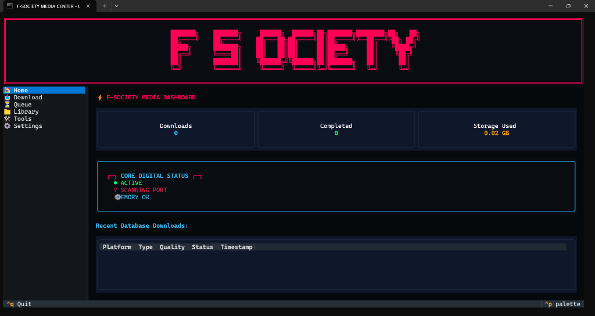
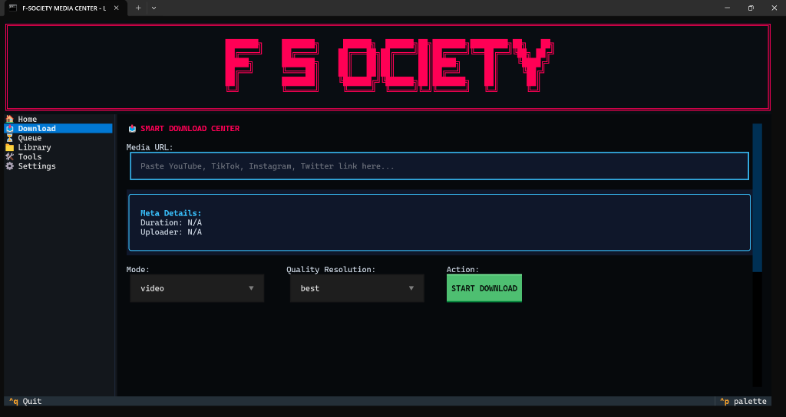

<p align="center">
  
</p>

# ⚡ F-SOCIETY MEDIA CENTER

[](https://www.python.org/downloads/)
[](LICENSE)
[](https://github.com/3abdulr7man/f-society-media/actions)
[](CHANGELOG.md)

**F-SOCIETY MEDIA CENTER** is a premium, open-source terminal user interface (TUI), desktop GUI, and CLI scripting wrapper for `yt-dlp` and `FFmpeg`. It delivers a fully featured environment for media extraction, queue processing, database tracking, and FFmpeg post-processing under a unified cyberpunk aesthetic.

---

## 🚀 Key Features

*   **📺 Modern Textual TUI**: A terminal interface featuring responsive layouts, custom modal screens (Help overlays, Error recovery dialogs), native `ProgressBar` widgets, active sidebar highlight tracking, and animated status widgets.
*   **💻 Desktop GUI**: A clean, cyberpunk-themed PySide6 application displaying metadata details, interactive downloads, settings hubs, media libraries, and logs in background threads.
*   **🛠️ FFmpeg Studio**: Extract audio tracks, convert video formats (MP4/MKV/etc.), trim files, merge video and audio, and compress media directly from the UI.
*   **⏳ Concurrency Batch Queue**: A database-backed queue manager supporting clipboard auto-detection, batch updates, and asynchronous download workers.
*   **📂 Local Media Library**: Scan download folders, explore metadata details, and open, play, or delete media files through the UI.
*   **🩺 Diagnostics System (`--doctor`)**: Headless health checker verifying Python packages, local `yt-dlp` updates, FFmpeg binary availability, SQLite schemas, and disk capacity.

---

## 📸 Screenshots

<p align="center">
  
  
</p>

---

## 📂 Repository Structure

```
f-society-media/
├── src/                  # Application source code
│   ├── cli/              # Textual TUI components and CLI dashboard
│   ├── gui/              # PySide6 desktop GUI code
│   └── core/             # Database controllers, logger, and extractor engines
│       └── platforms/    # Custom platforms metadata extractors (YouTube, TikTok, etc.)
├── tests/                # Testing suite
│   ├── unit/             # Offline, deterministic mock-based unit tests
│   ├── integration/      # Local integration tests requiring network connection
│   └── mocks/            # Global mock system for yt-dlp and network calls
├── docs/                 # Exhaustive guides
├── requirements.txt      # Dependency specification
├── pyproject.toml        # Modern packaging metadata
└── setup.py              # Classic setuptools installer
```

---

## ⚙️ Installation

Install from source using `pip` in editable or production mode:

```bash
# Clone the repository
git clone https://github.com/3abdulr7man/f-society-media.git
cd f-society-media

# Install requirements and script entry points
pip install -e .
```

---

## ⚡ Quick Start & Usage

F-SOCIETY installs entry points `fs` and `f-society` directly to your terminal.

### 1. Launch Modern Terminal TUI (Default)
Simply run the console command:
```bash
f-society
```
*   **Navigation**: Use **Arrow Keys** to change sidebar focus.
*   **Quick Tabs**: Press `h` (Home), `d` (Download), `q` (Queue), `l` (Library), `t` (Tools), or `s` (Settings).
*   **Help Panel**: Press `F1` or `?` at any time to overlay keyboard instructions.
*   **Exit**: Press `Ctrl+Q`.

### 2. Launch Desktop GUI App
```bash
f-society --gui
```

### 3. Run Clipboard Smart Watcher
```bash
f-society --watch
```

### 4. Run System Diagnostics
```bash
f-society --doctor
```
Add the `--report` flag to write system logs directly to `diagnostic_report.txt`:
```bash
f-society --doctor --report
```

---

## 🎛️ Command Line Scripting Reference

Directly execute downloader tasks from script command lines:

```bash
# Standard video download
f-society "https://www.youtube.com/watch?v=dQw4w9WgXcQ"

# Extract audio-only file (320kbps MP3)
f-society "https://www.youtube.com/watch?v=dQw4w9WgXcQ" --audio --quality 320

# Download image gallery post (Instagram/TikTok slideshows)
f-society "https://tiktok.com/@user/photo/123456" --images

# Save to a custom target directory
f-society "https://www.youtube.com/watch?v=dQw4w9WgXcQ" --dir "D:/Downloads"
```

---

## 🛠️ Developer & Testing Architecture

### Offline Testing & CI Isolation
To ensure 100% stable CI/CD runs, tests are split into two layers:
1.  **Unit Tests (`tests/unit`)**: Completely offline and network-isolated. Utilizing `tests/mocks/ytdlp_mock.py`, the `YoutubeDL` extraction and download methods are patched globally. No real internet requests occur.
2.  **Integration Tests (`tests/integration`)**: Local network-reliant tests skipped dynamically in CI environments using `@unittest.skipIf(os.getenv("CI") == "true")`.

Execute the unit test suite locally:
```bash
python -m unittest discover tests/unit -v
```

---

## 🩺 Troubleshooting

*   **YouTube Bot Block**: If extraction fails due to YouTube bot verification requests, go to **Settings Hub** and configure a valid `cookie_file` exported from your browser.
*   **Missing FFmpeg Warnings**: FFmpeg binaries are required for media trimming, audio extraction, and merging. Run `f-society --doctor` to verify binary presence. On Windows, ensure `ffmpeg.exe` and `ffprobe.exe` are in your system PATH variables.
*   **Database Corruption**: If the SQLite database file (`f_society.db`) gets locked or corrupted, delete it. The application will rebuild the schema and import old JSON migration configurations automatically on the next startup.

---

## 🛣️ Roadmap

*   [ ] Dynamic GUI custom skinning editor.
*   [ ] Multi-threaded concurrent download queues for GUI.
*   [ ] Advanced metadata tags editor via FFmpeg metadata streams.
*   [ ] Browser extension for single-click downloads routing.
